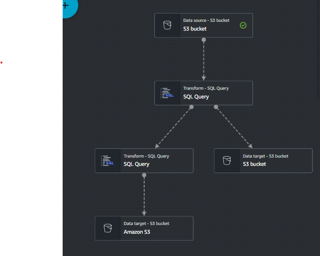

# Visualização do projeto na WEB

A Aplicação está no site http://15.229.46.108:5000/

Para saber mais das rotas, veja a baixo o capítulo [Rotas](#Rotas)

# Como rodar

Para rodar este teste em sua própria máquina ou servidor, deverá fazer:

- Clonar este repositorio

```
git clone https://github.com/RodrigoScola/testbackend.git
```

- Criar uma database `mysql`;

- Criar um arquivo .env e configurar com as seguintes variáveis, com os valores apropriados

```js
AWS_RDS_HOST=...
AWS_RDS_PORT=...
AWS_RDS_PASSWORD=...
AWS_RDS_USERNAME=...
AWS_RDS_DATABASE_NAME=...
AWS_S3_BUCKET_ACCESS_KEY_ID=...
AWS_S3_BUCKET_SECRET_KEY_ID=...
AWS_S3_BUCKET_REGION=...
```

- Entrar em sua `aws S3` e criar um bucket publicos com os seguintes nomes:

Como buckets não podem ter o mesmo nome, você deverá criar um bucket e ir no arquivo `constants` e alterar o `NOME_MENSAGENS_BUCKET` para o seu nome de bucket

Voce deverá criar as seguintes pastas:

- base_messages
- messages_with_username
- grouped_by_messages

> Buckets publicos são necessários para inserir os arquivos das mensagens

> Buckets públicos não são a melhor solução, mas eles serão removidos após o teste

- entrar na pasta do projeto e realizar o seguinte comando:

```
npm install

npm run dev
```

# Como foi feito o ETL

O etl foi feito utilizando `AWS glue` e o esquema visual foi feito manualmente:



A divisão de processos de de user_name e agrupamento são diferentes pois, assim podemos salvar eles em outro bucket S3. O Query que foi feito é:

```sql
SELECT
     email,
     id,
     postId,
     name,
     body,
     REGEXP_REPLACE(REGEXP_REPLACE(email, '^([^@]*)@', ''), '[.]',' ') as user_name from myDataSource
```

O query de agrupamento por `postId` que foi feito é:

```sql
SELECT
    postId,
    COUNT(*) AS quantidade_mensagens,
    MAX(id) AS id_ultima_mensagem,
    MAX(body) AS ultima_mensagem
    FROM
    myDataSource
GROUP BY
    postId;

```

# Rotas

## Mensagens

Para a visualicação dos resultados, podera baixar os arquivos aqui

ou podera ir para os arquivos neste projeto

- agrupadas por `postId`: `arquivos/mensages_agrupadas_postId.csv`

- Mensagens com user_name: `arquivos/mensagens_com_username.csv`

- Mensagens base: `arquivos/mensagens_base.json`

- Para a visualizacao base das mensages, ir para a rota (apos seguir os passos anteriores, estas mensagens estão no bucket `mesagens`)

```
localhost:5000/mensagens/
```

- Para a visualização de mensagens agrupadas ir para a rota:

```
localhost:5000/mensagens/agrupadas
```

- Para a visualização de mensagens com user_names ir para a rota:

```
localhost:5000/mensagens/com_usernames
```

## Funcionários

- Para a visualiação de funcionários, entre na rota:

```
localhost:5000/funcionarios/
```

- Para criar um novo funcionário, entre na rota:

```
localhost:5000/funcionarios/novo
```

- Para atualizar um funcionário, entre na rota:

```
localhost:5000/funcionarios/:id/editar
```

# Testes

Para a realização de testes, realizar o comando:

```
npm run test
```

> Se você quiser ver os testes, eles estarão no arquivo `__tests__/tests.tests.ts`
